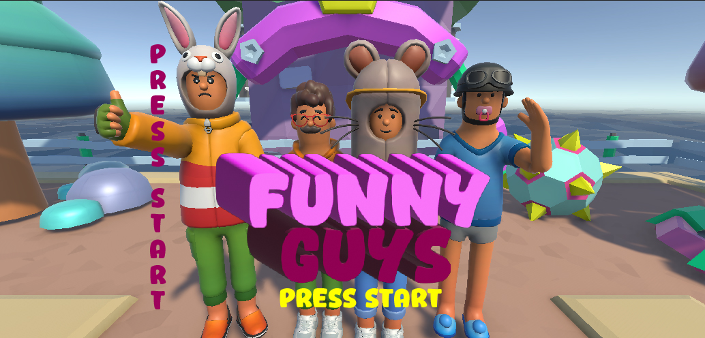

<!-- PROJECT LOGO -->

  

  <h3 align="center">UNITY 3D - C# | Platform Game Prototype</h3>

  

   FunnyGuys is the prototype of a platform and battle royale video game. Inspired by other well-known franchises, the game promises to enhance the player experience with fun worlds and unique mechanics where participants compete against each other in a series of randomly selected mini-games, such as obstacle courses or team soccer, etc.
     
    <a href="https://creativesth.itch.io/funny-guys"><strong>Demo »</strong></a>
     
  

  

